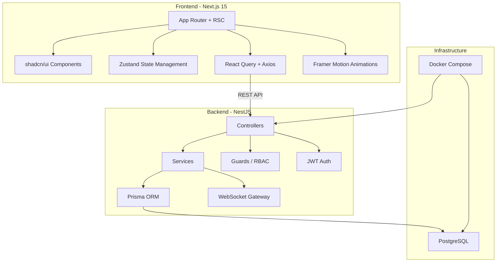
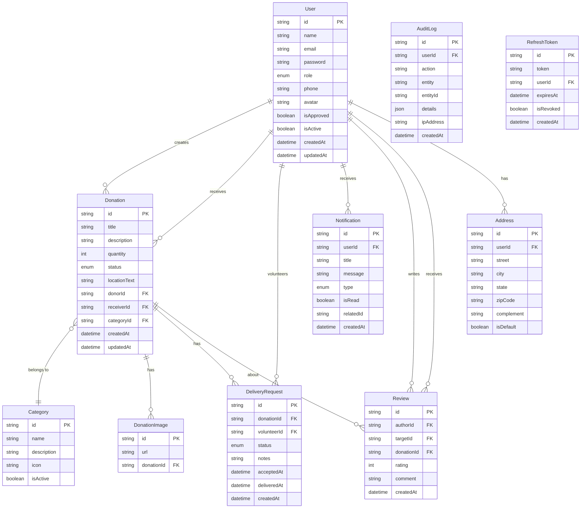
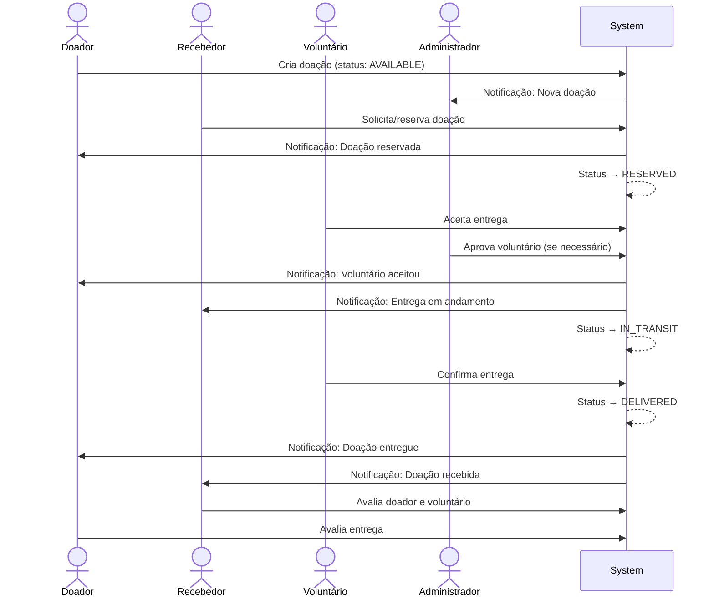

# Rede Solidária — Plano de Implementação Completo

Sistema full-stack de gestão de doações conectando doadores, recebedores, voluntários e administradores. Stack: **Next.js 15 + NestJS + Prisma + PostgreSQL + shadcn/ui + TailwindCSS + Framer Motion**.

---

## User Review Required

> [!IMPORTANT]
> **Banco de Dados**: O plano usa PostgreSQL via Docker. Confirme se você já tem Docker instalado ou se prefere usar um serviço externo (Neon, Supabase, etc.).

> [!IMPORTANT]
> **TailwindCSS versão**: O Next.js 15 mais recente suporta TailwindCSS v4 nativamente. Vamos usar **TailwindCSS v4** com configuração CSS-first. Confirme se está de acordo.

> [!WARNING]
> **Escopo do projeto**: Este é um projeto extremamente grande. A implementação será feita em **8 fases**. Cada fase será funcional e testável independentemente. A primeira entrega incluirá o back-end completo + autenticação + CRUD de doações + dashboard admin.

---

## Open Questions

1. **Upload de imagens**: Deseja armazenar imagens localmente no servidor (pasta `uploads/`) ou usar um serviço externo como AWS S3 / Cloudinary? → **Plano padrão: armazenamento local com multer, fácil de migrar para S3 depois.**
2. **Notificações em tempo real**: Usar WebSocket (Socket.io) integrado ao NestJS ou polling? → **Plano padrão: WebSocket via Socket.io Gateway no NestJS.**
3. **Email para recuperação de senha**: Deseja integração real com serviço de email (SendGrid, Nodemailer/SMTP) ou mock para desenvolvimento? → **Plano padrão: Nodemailer com configuração SMTP (pode ser Mailtrap para dev).**

---

## Arquitetura Geral



---

## Estrutura de Pastas

```
Rede Solidária_Engenharia3/
├── docker-compose.yml
├── .env.example
├── README.md
│
├── backend/
│   ├── Dockerfile
│   ├── package.json
│   ├── tsconfig.json
│   ├── nest-cli.json
│   ├── .env
│   ├── prisma/
│   │   ├── schema.prisma
│   │   ├── seed.ts
│   │   └── migrations/
│   └── src/
│       ├── main.ts
│       ├── app.module.ts
│       ├── common/
│       │   ├── decorators/
│       │   │   ├── roles.decorator.ts
│       │   │   ├── current-user.decorator.ts
│       │   │   └── public.decorator.ts
│       │   ├── filters/
│       │   │   └── http-exception.filter.ts
│       │   ├── guards/
│       │   │   ├── jwt-auth.guard.ts
│       │   │   └── roles.guard.ts
│       │   ├── interceptors/
│       │   │   └── transform.interceptor.ts
│       │   ├── pipes/
│       │   │   └── validation.pipe.ts
│       │   └── types/
│       │       └── index.ts
│       ├── config/
│       │   └── configuration.ts
│       ├── prisma/
│       │   ├── prisma.module.ts
│       │   └── prisma.service.ts
│       └── modules/
│           ├── auth/
│           │   ├── auth.module.ts
│           │   ├── auth.controller.ts
│           │   ├── auth.service.ts
│           │   ├── strategies/
│           │   │   ├── jwt.strategy.ts
│           │   │   └── jwt-refresh.strategy.ts
│           │   ├── guards/
│           │   │   └── jwt-refresh.guard.ts
│           │   └── dto/
│           │       ├── login.dto.ts
│           │       ├── register.dto.ts
│           │       └── refresh-token.dto.ts
│           ├── users/
│           │   ├── users.module.ts
│           │   ├── users.controller.ts
│           │   ├── users.service.ts
│           │   └── dto/
│           │       ├── create-user.dto.ts
│           │       └── update-user.dto.ts
│           ├── donations/
│           │   ├── donations.module.ts
│           │   ├── donations.controller.ts
│           │   ├── donations.service.ts
│           │   └── dto/
│           │       ├── create-donation.dto.ts
│           │       ├── update-donation.dto.ts
│           │       └── query-donation.dto.ts
│           ├── categories/
│           │   ├── categories.module.ts
│           │   ├── categories.controller.ts
│           │   ├── categories.service.ts
│           │   └── dto/
│           ├── deliveries/
│           │   ├── deliveries.module.ts
│           │   ├── deliveries.controller.ts
│           │   ├── deliveries.service.ts
│           │   └── dto/
│           ├── notifications/
│           │   ├── notifications.module.ts
│           │   ├── notifications.controller.ts
│           │   ├── notifications.service.ts
│           │   ├── notifications.gateway.ts
│           │   └── dto/
│           ├── reviews/
│           │   ├── reviews.module.ts
│           │   ├── reviews.controller.ts
│           │   ├── reviews.service.ts
│           │   └── dto/
│           ├── uploads/
│           │   ├── uploads.module.ts
│           │   ├── uploads.controller.ts
│           │   └── uploads.service.ts
│           └── admin/
│               ├── admin.module.ts
│               ├── admin.controller.ts
│               ├── admin.service.ts
│               └── dto/
│
├── frontend/
│   ├── Dockerfile
│   ├── package.json
│   ├── tsconfig.json
│   ├── next.config.ts
│   ├── components.json
│   ├── .env.local
│   ├── public/
│   │   └── images/
│   └── src/
│       ├── app/
│       │   ├── layout.tsx              # Root layout (providers, fonts, theme)
│       │   ├── page.tsx                # Landing page
│       │   ├── globals.css
│       │   ├── (auth)/
│       │   │   ├── login/page.tsx
│       │   │   ├── register/page.tsx
│       │   │   └── forgot-password/page.tsx
│       │   ├── (dashboard)/
│       │   │   ├── layout.tsx          # Dashboard layout (sidebar, header)
│       │   │   ├── admin/
│       │   │   │   ├── page.tsx        # Admin dashboard
│       │   │   │   ├── users/page.tsx
│       │   │   │   ├── donations/page.tsx
│       │   │   │   ├── categories/page.tsx
│       │   │   │   ├── reports/page.tsx
│       │   │   │   ├── logs/page.tsx
│       │   │   │   └── campaigns/page.tsx
│       │   │   ├── donor/
│       │   │   │   ├── page.tsx        # Donor dashboard
│       │   │   │   ├── donations/page.tsx
│       │   │   │   ├── donations/new/page.tsx
│       │   │   │   ├── donations/[id]/page.tsx
│       │   │   │   └── profile/page.tsx
│       │   │   ├── volunteer/
│       │   │   │   ├── page.tsx        # Volunteer dashboard
│       │   │   │   ├── deliveries/page.tsx
│       │   │   │   └── profile/page.tsx
│       │   │   └── receiver/
│       │   │       ├── page.tsx        # Receiver dashboard
│       │   │       ├── donations/page.tsx
│       │   │       ├── requests/page.tsx
│       │   │       └── profile/page.tsx
│       │   └── api/                    # Next.js API routes (optional proxy)
│       ├── components/
│       │   ├── ui/                     # shadcn/ui components
│       │   ├── layout/
│       │   │   ├── sidebar.tsx
│       │   │   ├── header.tsx
│       │   │   ├── footer.tsx
│       │   │   └── mobile-nav.tsx
│       │   ├── auth/
│       │   │   ├── login-form.tsx
│       │   │   └── register-form.tsx
│       │   ├── donations/
│       │   │   ├── donation-card.tsx
│       │   │   ├── donation-form.tsx
│       │   │   ├── donation-list.tsx
│       │   │   └── donation-filters.tsx
│       │   ├── dashboard/
│       │   │   ├── stats-card.tsx
│       │   │   ├── charts.tsx
│       │   │   └── recent-activity.tsx
│       │   ├── notifications/
│       │   │   └── notification-panel.tsx
│       │   └── shared/
│       │       ├── data-table.tsx
│       │       ├── file-upload.tsx
│       │       ├── loading.tsx
│       │       ├── empty-state.tsx
│       │       └── confirm-dialog.tsx
│       ├── hooks/
│       │   ├── use-auth.ts
│       │   ├── use-donations.ts
│       │   ├── use-notifications.ts
│       │   └── use-debounce.ts
│       ├── lib/
│       │   ├── api.ts                  # Axios instance
│       │   ├── utils.ts
│       │   └── constants.ts
│       ├── providers/
│       │   ├── auth-provider.tsx
│       │   ├── query-provider.tsx
│       │   └── theme-provider.tsx
│       ├── services/
│       │   ├── auth.service.ts
│       │   ├── donations.service.ts
│       │   ├── users.service.ts
│       │   └── notifications.service.ts
│       ├── store/
│       │   ├── auth-store.ts
│       │   └── notification-store.ts
│       ├── types/
│       │   └── index.ts
│       └── middleware.ts               # Next.js middleware (route protection)
```

---

## Modelagem do Banco de Dados (Prisma Schema)



### Enums

| Enum | Valores |
|------|---------|
| `Role` | `ADMIN`, `DONOR`, `VOLUNTEER`, `RECEIVER` |
| `DonationStatus` | `AVAILABLE`, `RESERVED`, `IN_TRANSIT`, `DELIVERED`, `CANCELLED` |
| `DeliveryStatus` | `PENDING`, `ACCEPTED`, `IN_TRANSIT`, `DELIVERED`, `CANCELLED` |
| `NotificationType` | `DONATION`, `DELIVERY`, `SYSTEM`, `REVIEW`, `APPROVAL` |

---

## Rotas da API

### Auth (`/api/auth`)
| Método | Rota | Descrição | Acesso |
|--------|------|-----------|--------|
| POST | `/register` | Cadastro de usuário | Público |
| POST | `/login` | Login | Público |
| POST | `/refresh` | Refresh token | Autenticado |
| POST | `/logout` | Logout | Autenticado |
| POST | `/forgot-password` | Solicitar reset de senha | Público |
| POST | `/reset-password` | Resetar senha | Público |
| GET | `/me` | Perfil do usuário logado | Autenticado |

### Users (`/api/users`)
| Método | Rota | Descrição | Acesso |
|--------|------|-----------|--------|
| GET | `/` | Listar usuários | Admin |
| GET | `/:id` | Detalhes do usuário | Admin / Próprio |
| PATCH | `/:id` | Atualizar usuário | Admin / Próprio |
| PATCH | `/:id/approve` | Aprovar voluntário | Admin |
| PATCH | `/:id/block` | Bloquear/Desbloquear | Admin |
| DELETE | `/:id` | Soft delete | Admin |

### Donations (`/api/donations`)
| Método | Rota | Descrição | Acesso |
|--------|------|-----------|--------|
| GET | `/` | Listar doações (com filtros) | Autenticado |
| GET | `/:id` | Detalhes da doação | Autenticado |
| POST | `/` | Criar doação | Donor |
| PATCH | `/:id` | Atualizar doação | Donor (dono) |
| PATCH | `/:id/status` | Alterar status | Admin / Donor / Volunteer |
| PATCH | `/:id/reserve` | Reservar doação | Receiver |
| DELETE | `/:id` | Cancelar doação | Donor (dono) / Admin |

### Categories (`/api/categories`)
| Método | Rota | Descrição | Acesso |
|--------|------|-----------|--------|
| GET | `/` | Listar categorias | Público |
| POST | `/` | Criar categoria | Admin |
| PATCH | `/:id` | Atualizar categoria | Admin |
| DELETE | `/:id` | Remover categoria | Admin |

### Deliveries (`/api/deliveries`)
| Método | Rota | Descrição | Acesso |
|--------|------|-----------|--------|
| GET | `/` | Listar entregas | Admin / Volunteer |
| GET | `/:id` | Detalhes da entrega | Autenticado |
| POST | `/` | Aceitar entrega | Volunteer |
| PATCH | `/:id/status` | Atualizar status | Volunteer / Admin |

### Reviews (`/api/reviews`)
| Método | Rota | Descrição | Acesso |
|--------|------|-----------|--------|
| GET | `/donation/:id` | Reviews de uma doação | Autenticado |
| POST | `/` | Criar review | Donor / Receiver |

### Notifications (`/api/notifications`)
| Método | Rota | Descrição | Acesso |
|--------|------|-----------|--------|
| GET | `/` | Listar notificações | Autenticado |
| PATCH | `/:id/read` | Marcar como lida | Autenticado |
| PATCH | `/read-all` | Marcar todas como lidas | Autenticado |

### Admin (`/api/admin`)
| Método | Rota | Descrição | Acesso |
|--------|------|-----------|--------|
| GET | `/dashboard` | Métricas do dashboard | Admin |
| GET | `/reports` | Relatórios | Admin |
| GET | `/logs` | Logs de auditoria | Admin |
| GET | `/reports/export` | Exportar relatório CSV | Admin |

### Uploads (`/api/uploads`)
| Método | Rota | Descrição | Acesso |
|--------|------|-----------|--------|
| POST | `/image` | Upload de imagem | Autenticado |
| DELETE | `/:id` | Remover imagem | Autenticado |

---

## Fases de Implementação

### Fase 1: Infraestrutura & Setup ⏱️ ~1h
- Docker Compose (PostgreSQL)
- Projeto NestJS (backend)
- Projeto Next.js 15 (frontend)
- Configuração Prisma + Schema
- Configuração TailwindCSS v4 + shadcn/ui
- Tema, fontes, variáveis CSS (identidade visual verde/azul)
- README.md e .env.example

### Fase 2: Back-end Core ⏱️ ~2h
- Módulo Prisma (PrismaService global)
- Módulo Auth (Register, Login, JWT, Refresh Token, Recuperação de Senha)
- Módulo Users (CRUD, Aprovar, Bloquear)
- Guards (JwtAuthGuard, RolesGuard)
- Decorators (@Roles, @CurrentUser, @Public)
- Exception filters
- Validation pipes
- Swagger setup
- Rate limiting (Throttler)
- Helmet
- CORS
- Seed do banco de dados

### Fase 3: Back-end Modules ⏱️ ~1.5h
- Módulo Categories (CRUD)
- Módulo Donations (CRUD, filtros, paginação, status)
- Módulo Deliveries (aceitar, atualizar status)
- Módulo Reviews
- Módulo Uploads (Multer)
- Módulo Notifications (CRUD + WebSocket Gateway)
- Módulo Admin (Dashboard metrics, Reports, Logs)
- Audit Log interceptor

### Fase 4: Front-end Foundation ⏱️ ~1.5h
- Layout root (providers, tema dark/light, fonts)
- Landing page (hero, features, CTA)
- Páginas de Auth (Login, Register, Forgot Password)
- Middleware de proteção de rotas
- Axios instance com interceptors (token refresh)
- Auth store (Zustand)
- React Query provider
- API services layer

### Fase 5: Dashboard & Admin ⏱️ ~2h
- Dashboard layout (Sidebar, Header, Mobile Nav)
- Admin Dashboard (métricas, gráficos com Recharts)
- Admin: Gestão de Usuários (DataTable, aprovar, bloquear)
- Admin: Gestão de Doações
- Admin: Gestão de Categorias
- Admin: Relatórios (exportar CSV)
- Admin: Logs de Auditoria

### Fase 6: Dashboards de Usuários ⏱️ ~2h
- Donor Dashboard (estatísticas pessoais)
- Donor: Criar/Editar Doação (form com upload)
- Donor: Lista de Doações (filtros, status)
- Donor: Histórico
- Volunteer Dashboard
- Volunteer: Doações disponíveis
- Volunteer: Aceitar/Gerenciar entregas
- Receiver Dashboard
- Receiver: Buscar doações
- Receiver: Solicitar/Aceitar doações
- Receiver: Histórico de recebimentos

### Fase 7: Features Avançadas ⏱️ ~1.5h
- Sistema de Notificações (painel, tempo real)
- Sistema de Avaliações (estrelas, comentários)
- Busca inteligente com debounce
- Infinite scroll
- Filtros avançados
- Upload de comprovantes/fotos
- Glassmorphism e micro-animações (Framer Motion)

### Fase 8: Polish & Deploy ⏱️ ~1h
- SEO (meta tags, Open Graph)
- Performance (lazy loading, Image optimization)
- Dockerfiles (front + back)
- Docker Compose completo
- Scripts de inicialização
- Seeds finais
- README completo
- Testes de integração básicos

---

## Identidade Visual

| Elemento | Valor |
|----------|-------|
| **Cor primária** | `hsl(152, 68%, 40%)` — Verde solidário |
| **Cor secundária** | `hsl(210, 80%, 55%)` — Azul confiança |
| **Accent** | `hsl(160, 60%, 50%)` — Verde-água |
| **Background (dark)** | `hsl(220, 25%, 8%)` |
| **Background (light)** | `hsl(0, 0%, 98%)` |
| **Card (dark)** | `hsl(220, 20%, 12%)` com glassmorphism |
| **Card (light)** | `hsl(0, 0%, 100%)` com glassmorphism |
| **Fonte principal** | Inter (Google Fonts) |
| **Fonte heading** | Outfit (Google Fonts) |
| **Border radius** | `0.75rem` |
| **Glassmorphism** | `backdrop-filter: blur(16px); background: rgba(...)` |

---

## Wireframes das Telas Principais

### Landing Page
```
┌─────────────────────────────────────────────┐
│  Logo   Nav(Home, Sobre, Contato)  [Login]  │
├─────────────────────────────────────────────┤
│                                             │
│     Conectando solidariedade               │
│     com quem mais precisa                  │
│                                             │
│  [Quero Doar]  [Preciso de Doação]         │
│                                             │
├─────────────────────────────────────────────┤
│  ┌──────┐ ┌──────┐ ┌──────┐ ┌──────┐      │
│  │Stats │ │Stats │ │Stats │ │Stats │      │
│  │Card  │ │Card  │ │Card  │ │Card  │      │
│  └──────┘ └──────┘ └──────┘ └──────┘      │
├─────────────────────────────────────────────┤
│  Como funciona? (3 steps)                  │
├─────────────────────────────────────────────┤
│  Categorias de doação (grid)               │
├─────────────────────────────────────────────┤
│  Footer                                    │
└─────────────────────────────────────────────┘
```

### Admin Dashboard
```
┌─────┬────────────────────────────────────────┐
│     │  Header [Notificações] [Perfil]        │
│  S  ├────────────────────────────────────────┤
│  I  │  ┌─────┐ ┌─────┐ ┌─────┐ ┌─────┐    │
│  D  │  │Total│ │Usrs │ │Entr.│ │Volun│    │
│  E  │  │Doaç.│ │Ativ.│ │Real.│ │Ativ.│    │
│  B  │  └─────┘ └─────┘ └─────┘ └─────┘    │
│  A  ├──────────────────┬─────────────────────┤
│  R  │                  │                     │
│     │  Gráfico         │  Atividade Recente  │
│     │  Doações/Mês     │  - Doação criada    │
│     │                  │  - Usuário aprovado  │
│     │                  │  - Entrega feita     │
│     ├──────────────────┴─────────────────────┤
│     │  Doações Recentes (DataTable)          │
│     │  [Filtros] [Busca] [Exportar]          │
└─────┴────────────────────────────────────────┘
```

### Donor - Criar Doação
```
┌─────┬────────────────────────────────────────┐
│  S  │  Nova Doação                           │
│  I  ├────────────────────────────────────────┤
│  D  │  Título: [_______________]             │
│  E  │  Descrição: [________________]        │
│  B  │  Categoria: [Dropdown ▼]              │
│  A  │  Quantidade: [___]                     │
│  R  │  Localização: [_______________]        │
│     │                                        │
│     │  📷 Arrastar fotos aqui               │
│     │  ┌────┐ ┌────┐ ┌────┐                │
│     │  │img1│ │img2│ │ +  │                │
│     │  └────┘ └────┘ └────┘                │
│     │                                        │
│     │  [Cancelar]  [Publicar Doação]        │
└─────┴────────────────────────────────────────┘
```

---

## Fluxo Completo entre Usuários



---

## Casos de Uso Principais

| # | Caso de Uso | Ator | Descrição |
|---|------------|------|-----------|
| UC01 | Cadastrar-se | Todos | Usuário se cadastra selecionando tipo |
| UC02 | Fazer login | Todos | Autenticação com email/senha |
| UC03 | Criar doação | Doador | Preenche formulário com fotos e localização |
| UC04 | Buscar doações | Recebedor | Filtra doações disponíveis por categoria/local |
| UC05 | Reservar doação | Recebedor | Solicita receber uma doação disponível |
| UC06 | Aceitar entrega | Voluntário | Voluntário se oferece para transportar |
| UC07 | Atualizar status | Voluntário | Marca progresso da entrega |
| UC08 | Avaliar | Doador/Recebedor | Avalia a experiência com nota e comentário |
| UC09 | Aprovar voluntário | Admin | Admin verifica e aprova cadastro |
| UC10 | Gerenciar sistema | Admin | CRUD completo de todas as entidades |
| UC11 | Ver dashboard | Admin | Visualiza métricas e relatórios |
| UC12 | Exportar relatório | Admin | Exporta dados em CSV |

---

## Verification Plan

### Automated Tests
1. **Backend**: Executar `npm run build` para verificar compilação TypeScript
2. **Backend**: Executar `npx prisma validate` para verificar schema
3. **Backend**: Executar `npx prisma db push` e seed para verificar integridade do banco
4. **Frontend**: Executar `npm run build` para verificar compilação Next.js
5. **Docker**: Executar `docker-compose up` para verificar toda a stack

### Manual Verification
1. Testar fluxo completo de cadastro → login → criar doação → reservar → entregar
2. Verificar responsividade em múltiplos tamanhos de tela
3. Verificar tema dark/light
4. Testar RBAC (cada tipo de usuário só acessa o permitido)
5. Verificar Swagger UI em `/api/docs`
6. Testar WebSocket de notificações
